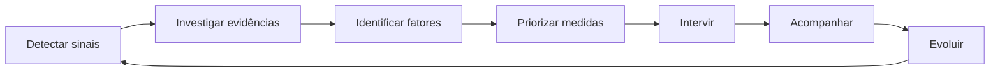
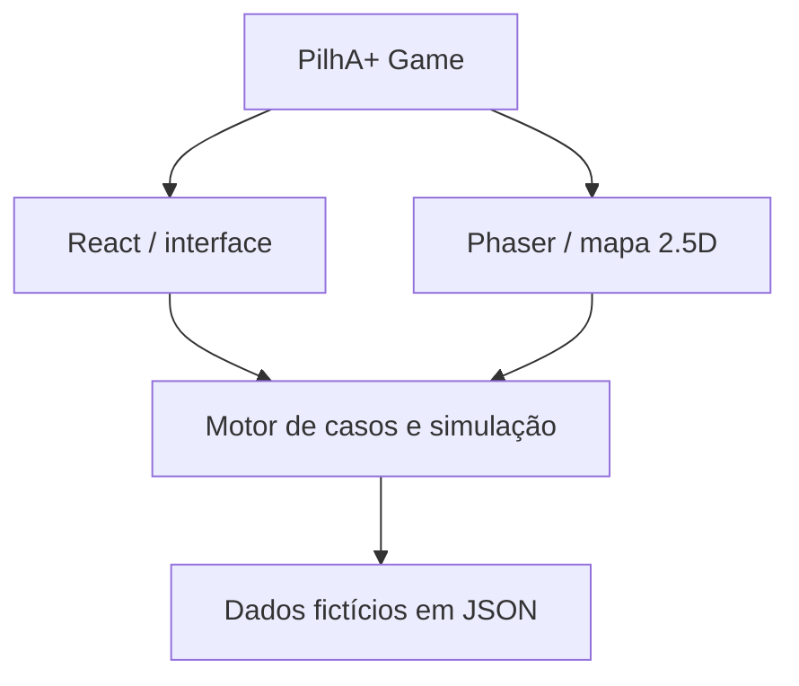

# Diagramas de projeto
[Diagrama editável do core loop — FigJam](https://www.figma.com/board/i2BUcF0vH9CRcdXtvPa0k9)

```mermaid
flowchart LR
A["Detectar sinais"] --> B["Investigar evidências"]
B --> C["Identificar fatores"]
C --> D["Priorizar medidas"]
D --> E["Intervir"]
E --> F["Acompanhar"]
F --> G["Evoluir"]
G --> A
```

```mermaid
flowchart TD
J["PilhA+ Game"] --> U["React / interface"]
J --> P["Phaser / mapa 2.5D"]
U --> M["Motor de casos e simulação"]
P --> M
M --> D["Dados fictícios em JSON"]
```
